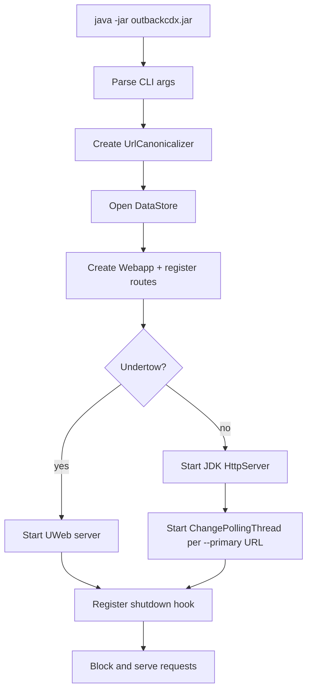

# Runtime Flow

## Starting the Server

The server is launched as a fat JAR:

```
java -Xmx512m -jar outbackcdx*.jar [options...]
```

`Main.java` parses all CLI arguments and then:

1. Instantiates a `UrlCanonicalizer` (loading the optional fuzzy-match YAML if `-y` is provided).
2. Opens the `DataStore`, which manages the data directory but does **not** immediately open any RocksDB databases — they open lazily on first access.
3. Optionally creates a `Replay` object if `--warc-base-url` is set.
4. Instantiates `Webapp`, which registers all HTTP routes.
5. Starts the HTTP server (JDK `HttpServer` by default, Undertow if `-u` is passed).
6. For each `--primary` URL provided, starts a `ChangePollingThread` daemon thread.
7. Registers a JVM shutdown hook that stops the HTTP server and closes the `DataStore`.
8. Blocks indefinitely (`Main.class.wait()`).



## Collection Initialisation

Collections are opened lazily on first access.

When a request arrives for a collection that has not been opened yet, `DataStore.openDb()` is called.
It configures RocksDB (Snappy compression, level compaction, Bloom filter optimisation) and opens the appropriate column families:

- `default` — CDX records
- `alias` — URL aliases
- `access-rule` and `access-policy` — only when `EXPERIMENTAL_ACCESS_CONTROL=1`

If the collection directory does not exist and the request is a write, the database is created. For reads, a missing collection returns `404`.

## Feature Flag Initialisation

Feature flags are read from environment variables once at class load time (`FeatureFlags` static initialiser), and from CLI arguments during `Main.main()`.
They cannot be changed at runtime after startup.

## Request Handling

Every HTTP request flows through:

1. The JDK `HttpServer` or Undertow front-end.
2. `Web.SHandler` (or `UWeb.UHandler`), which extracts path and method.
3. The `Authorizer`, which checks whether the request has the required `Permission` for write operations.
4. `Webapp`'s `Router`, which matches the path and dispatches to the appropriate handler method.

## Replication (Secondary Mode)

When `--primary <collection-url>` is given, a `ChangePollingThread` runs in the background:

- Every `--update-interval` seconds (default 10) it requests `/changes?since=<lastSeqNo>&size=<batchSize>` from the primary.
- The primary's `changeFeed` handler reads from RocksDB's WAL and streams write batches as base64-encoded JSON.
- The secondary deserialises each batch and applies it to its local RocksDB.
- The secondary's latest applied sequence number is stored as a RocksDB key (`#ReplicationSequence`) so it survives restarts.

## What Happens While Running

After startup the server continuously:

- Accepts CDX query requests (GET) and returns matching records.
- Accepts CDX ingest requests (POST) and writes records to RocksDB in batches.
- (Secondary only) Polls upstream for changes and applies them.
- Serves the web dashboard UI and API documentation from embedded static assets.
- Optionally serves WARC replay responses by reading WARC files via HTTP range requests.

## Dev / Test Differences

There is no separate dev or prod configuration mechanism.
Tests (`WebappTest`, `IndexTest`) create `DataStore` and `Webapp` instances directly with temporary directories and in-memory RocksDB environments, bypassing the CLI and HTTP server entirely.
Integration tests in `test-integration/` launch a real server process via shell scripts.
