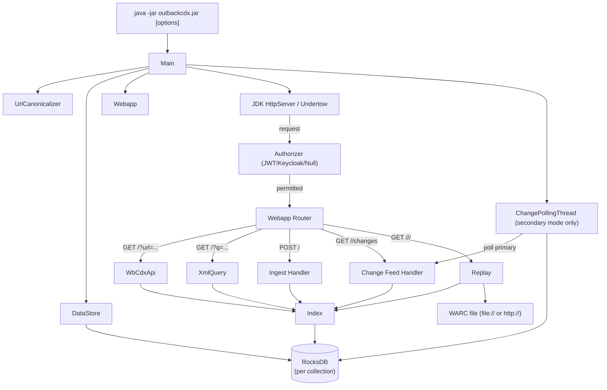
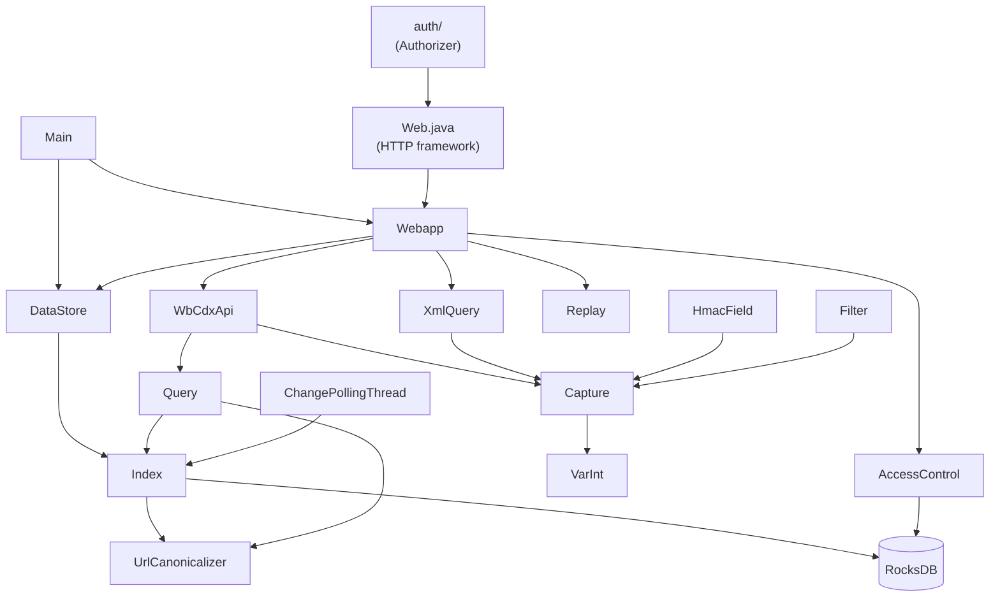
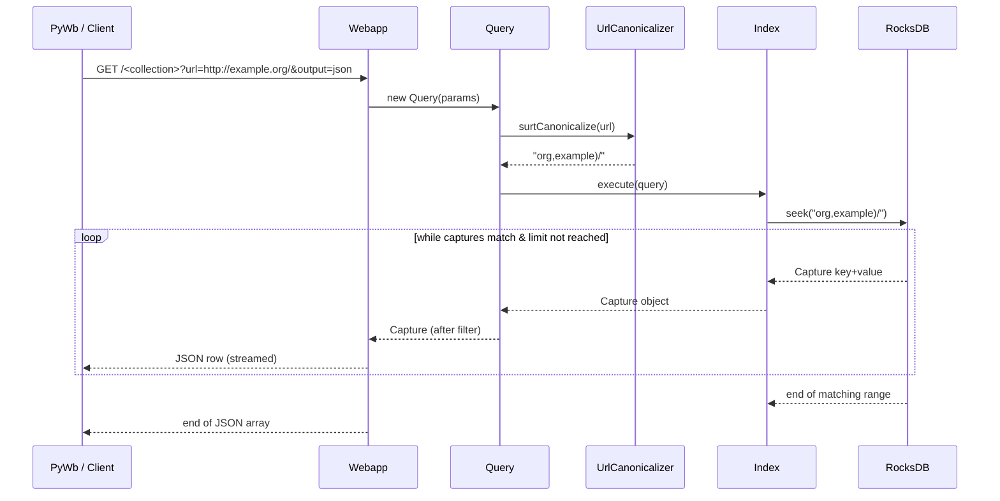
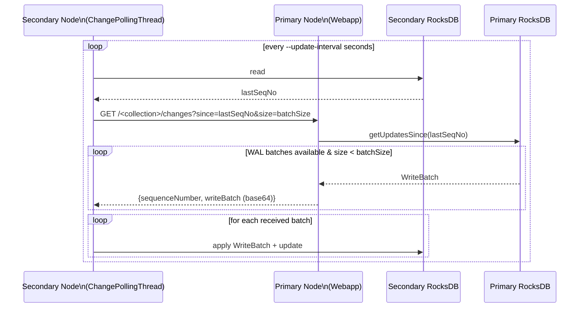
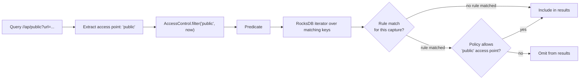

# Diagrams

## 1. Runtime Flow

---

## 2. Module / File Interaction

---

## 3. Sequence Diagram — CDX Query (PyWb Protocol)

---

## 4. Replication Flow (Primary → Secondary)

---

## 5. Access Control Evaluation

